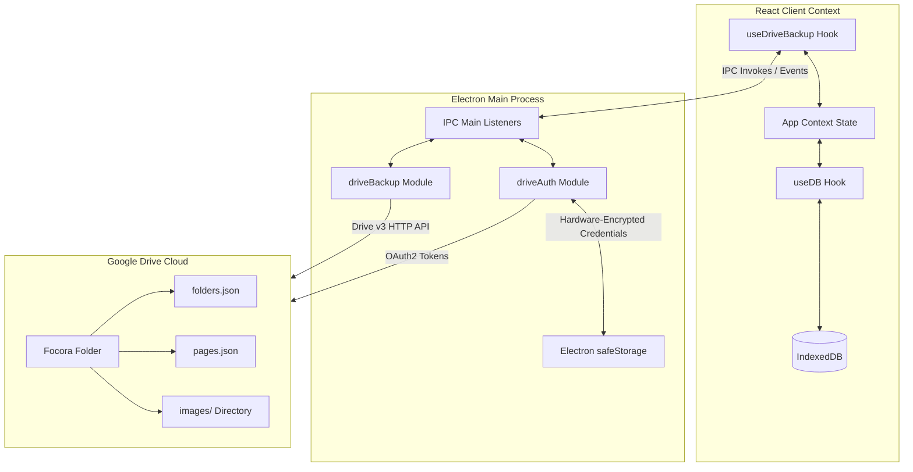
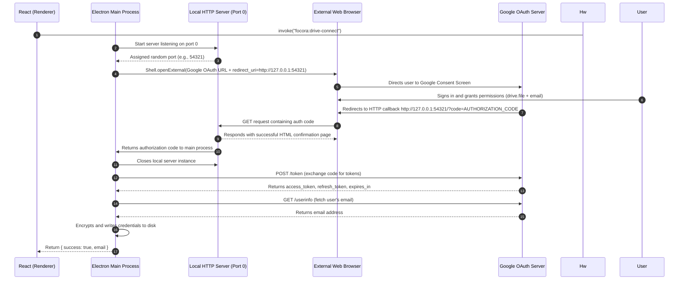
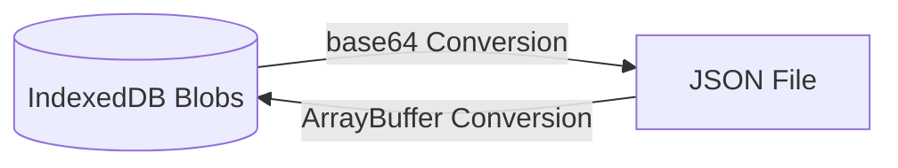
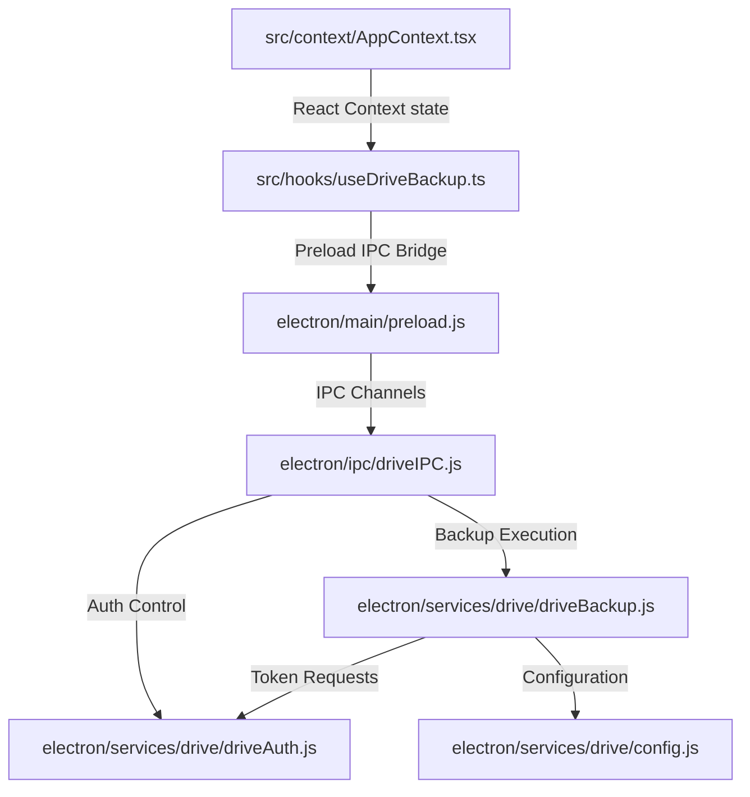

# Focora Notes: Google Drive Backup & Sync System
This document serves as the complete technical specification and architecture guide for the Google Drive backup, restore, and local synchronization system implemented in **Focora Notes**. The goal of this document is to enable complete understanding, replication, and troubleshooting of this system in other projects (e.g., Focora Timer) without needing to inspect the source code.

---

## 1. High-Level Architecture

The backup system utilizes a hybrid local-cloud model. While data is saved locally in IndexedDB for offline-first speed and responsiveness, it can be synchronized to the user's private Google Drive storage. 

### Data & Workflow Architecture


### Overall Data Flow
- **Local Storage**: IndexedDB is the source of truth for folders, page metadata, full page content, and binary image attachments (`Blob`s).
- **Google Drive Storage**: A dedicated app directory named `Focora` is created. Inside, folder metadata (`folders.json`) and page data (`pages.json`) are stored. Images are separated into an `images/` subfolder, named by their unique content identifiers (e.g., `img-abc12345.png`).
- **Sync Methodology**: 
  - **Metadata (Folders & Pages)**: Full overwrite on backup/restore. The local structure is packaged as JSON and uploaded in a single call.
  - **Assets (Images)**: Incremental sync. A hash comparison (MD5) is executed between local image records and the files on Google Drive. Only new or modified images are uploaded, and deleted images are purged from the cloud.

---

## 2. Google Authentication & Authorization Flow

Focora Notes uses standard **OAuth 2.0 for Desktop Applications** to authenticate users and obtain access tokens for the Google Drive API.

### OAuth 2.0 Authentication Sequence


### Key Authentication Mechanisms
1. **Loopback Server Callback (Port 0)**:
   - Opening a server bound to `127.0.0.1` on port `0` prompts the operating system to allocate an arbitrary, unassigned port.
   - This eliminates port conflict issues on local machines, allowing multiple developers or instances to run concurrently.
   - The redirect URI passed to Google dynamically changes depending on the port assigned (e.g., `http://127.0.0.1:54321`).
2. **Access Token Refresh Protocol**:
   - Access tokens expire after 1 hour (3600 seconds).
   - Before making any Drive API call, `getAccessToken()` is checked. If the token expires in less than 5 minutes, it automatically triggers a silent refresh using the `refresh_token` without user interaction:
     ```js
     const params = new URLSearchParams({
       client_id: GOOGLE_CLIENT_ID,
       client_secret: GOOGLE_CLIENT_SECRET,
       refresh_token: authState.refreshToken,
       grant_type: 'refresh_token'
     });
     const res = await fetch('https://oauth2.googleapis.com/token', {
       method: 'POST',
       headers: { 'Content-Type': 'application/x-www-form-urlencoded' },
       body: params.toString()
     });
     ```
3. **Logout & Disconnection**:
   - The disconnect method calls `https://oauth2.googleapis.com/revoke?token=ACCESS_TOKEN` via POST to revoke tokens on Google's authorization servers.
   - Local credential files are deleted from the disk and local cache states are cleared.
4. **Token Security & safeStorage**:
   - Storing raw plaintext tokens poses a security vulnerability. Focora Notes encrypts the tokens before writing them to the disk using Electron's `safeStorage` module.
   - On Windows, `safeStorage` uses DPAPI (Data Protection API) which binds encryption to the specific Windows user credentials. On macOS, it leverages the system Keychain.
   - Data stored in `drive-credentials.json` looks like this:
     ```json
     {
       "accessToken": "enc_base64_string...",
       "refreshToken": "enc_base64_string...",
       "expiryTime": 1783459200000,
       "email": "user@gmail.com"
     }
     ```

---

## 3. Google Drive API Integration

Focora Notes integrates with the Google Drive API v3. All requests use HTTP fetch calls with OAuth bearer authorization.

### Endpoints and Parameters
All endpoints are queried using the base URL: `https://www.googleapis.com/drive/v3`. Below are the endpoints, headers, and request parameter configurations used in the project:

#### 1. Search File/Folder by App Properties
- **Endpoint**: `GET /files`
- **Headers**:
  - `Authorization: Bearer <ACCESS_TOKEN>`
- **Query Parameters**:
  - `q`: Search filter string. E.g., `appProperties has { key='type' and value='root' } and trashed=false`. Encoded as URI components.
  - `fields`: Field selection string. Focora queries `files(id, name, md5Checksum, appProperties)` to limit payload sizes.
- **Example Usage**:
  ```js
  const q = encodeURIComponent(`appProperties has { key='type' and value='root' } and trashed=false`);
  const res = await driveRequest(`/files?q=${q}&fields=files(id, name, md5Checksum, appProperties)`);
  ```

#### 2. Create Folder or File Metadata
- **Endpoint**: `POST /files`
- **Headers**:
  - `Authorization: Bearer <ACCESS_TOKEN>`
  - `Content-Type: application/json`
- **Request Body**:
  ```json
  {
    "name": "images",
    "mimeType": "application/vnd.google-apps.folder",
    "parents": ["PARENT_FOLDER_ID"],
    "appProperties": {
      "type": "images-dir"
    }
  }
  ```

#### 3. Upload File Media (Overwrite / PATCH)
- **Endpoint**: `PATCH https://www.googleapis.com/upload/drive/v3/files/<FILE_ID>?uploadType=media`
- **Headers**:
  - `Authorization: Bearer <ACCESS_TOKEN>`
  - `Content-Type: <MIME_TYPE>` (e.g., `application/json` or `image/png`)
- **Request Body**: Binary buffer or string containing file payload.
- **Example**:
  ```js
  await driveRequest(`/upload/files/${fileId}?uploadType=media`, {
    method: 'PATCH',
    headers: { 'Content-Type': mimeType },
    body: fileBuffer
  });
  ```

#### 4. Download File Content
- **Endpoint**: `GET /files/<FILE_ID>?alt=media`
- **Headers**:
  - `Authorization: Bearer <ACCESS_TOKEN>`
- **Response**: The raw body of the file (JSON text or binary array buffer).

#### 5. Delete File
- **Endpoint**: `DELETE /files/<FILE_ID>`
- **Headers**:
  - `Authorization: Bearer <ACCESS_TOKEN>`
- **Response**: 204 No Content.

---

## 4. Backup System Mechanics

### 1. Serialization & Runtime Sanitation
Before serializing page collections to the JSON upload buffer, Focora Notes performs a strict sanitation pass. 
> [!IMPORTANT]
> The runtime flag `_hydrated` indicates whether a page's full text content has been loaded from IndexedDB during the current React session. **If this flag is saved to disk or uploaded to Drive, it causes a critical restore bug.** Upon import, the React app detects `_hydrated: true` and falsely assumes the page is fully loaded, skipping database lookups and overwriting active pages with empty shells. Focora explicitly strips `_hydrated` from all folders and pages before serialization:
```js
const cleanPages = pages.map(({ _hydrated, ...p }) => p);
const cleanFolders = folders.map(({ _hydrated, ...f }) => f);
```

### 2. File Format and Structure
- **folders.json**: Array of Folder metadata.
- **pages.json**: Array of Page records containing markdown text, layouts, coordinate scales, and drawing paths.
- **images/**: Directory storing all uploaded media. File names are the image IDs, with extension mappings based on their MIME type (e.g., `img-1a2b3c.jpeg`).

### 3. Incremental Image Sync & Conflict Avoidance
Uploading images repeatedly wastes bandwidth and slows operations. The backup process uses an **MD5 Checksum comparison**:
1. It queries the local IndexedDB to find all image record metadata.
2. It fetches the remote file list of the Drive `images/` directory.
3. For each local image, it verifies if an item with `appProperties.imageId === img.id` exists on the Drive.
   - If missing: Scheduled for upload.
   - If present: Compares the remote file's `md5Checksum` against the local image buffer MD5 hash. If they do not match, it schedules a PATCH request to overwrite the file on Drive.
4. **Purging Deleted Images**: If an image exists in the Google Drive `images/` folder but its `imageId` is no longer referenced anywhere in the local database, a `DELETE` request is sent to remove it.

---

## 5. Restore System Mechanics

### 1. Download & Buffer
Focora initiates a download transaction for both files (`folders.json`, `pages.json`). Next, it fetches the file list from the remote `images/` folder and downloads each asset as an `ArrayBuffer` in parallel.

### 2. Transaction-Safe Database Writes
To prevent database corruption during network interruptions, Focora performs the local write inside a single atomic IndexedDB transaction covering all modified tables:
```js
const tx = db.transaction([STORES.FOLDERS, STORES.PAGES, STORES.IMAGES], "readwrite");
const folderStore = tx.objectStore(STORES.FOLDERS);
const pageStore = tx.objectStore(STORES.PAGES);
const imageStore = tx.objectStore(STORES.IMAGES);

// A. Wipe current database records
await folderStore.clear();
await pageStore.clear();
await imageStore.clear();

// B. Load sanitized folders & pages
for (const f of sanitizedFolders) await folderStore.put(f);
for (const p of sanitizedPages) await pageStore.put(p);

// C. Reconstruct image Blobs from downloaded ArrayBuffers
for (const img of restoredImages) {
  const blob = new Blob([img.arrayBuffer], { type: img.mimeType });
  await imageStore.put({
    id: img.id,
    pageId: img.pageId,
    blob,
    mimeType: img.mimeType,
    createdAt: Date.now()
  });
}
```
If any write fails or is interrupted, the transaction aborts automatically, keeping the existing database records intact.

---

## 6. Database Export / Import

For local JSON backups, Focora exports/imports data without requiring active network connectivity:



- **Export Binary Conversion**: JavaScript's standard `JSON.stringify` cannot serialize binary `Blob` objects. For local exports, Focora maps image records to Base64 data URIs:
  ```js
  const blobToBase64 = (blob) => {
    return new Promise((resolve, reject) => {
      const reader = new FileReader();
      reader.onloadend = () => resolve(reader.result);
      reader.onerror = reject;
      reader.readAsDataURL(blob);
    });
  };
  ```
- **Import Reconstruction**: Upon importing a local JSON file, Base64 strings are parsed back into native binary Blobs using the inverse conversion helper before writing to the database:
  ```js
  const base64ToBlob = (base64, mimeType) => {
    const byteString = atob(base64.split(',')[1]);
    const ab = new ArrayBuffer(byteString.length);
    const ia = new Uint8Array(ab);
    for (let i = 0; i < byteString.length; i++) {
      ia[i] = byteString.charCodeAt(i);
    }
    return new Blob([ab], { type: mimeType });
  };
  ```

---

## 7. Project Structure & Dependency Graph

Here are the primary components involved in the Drive Sync operation:

### Dependency Mapping


### Module Responsibilities
1. **`driveConfig.js`**: Stores OAuth app identity parameters (`GOOGLE_CLIENT_ID`, `GOOGLE_CLIENT_SECRET`).
2. **`driveAuth.js`**: Handles local HTTP loopback server creation, consent redirects, token exchange, token rotation, and safeStorage cryptography.
3. **`driveBackup.js`**: Direct controller for remote Google Drive file listings, downloads, updates, metadata creation, and deletions.
4. **`driveIPC.js`**: Bridges Electron's Main and Renderer threads by handling asynchronously invoked IPC messages.
5. **`preload.js`**: Context-isolates communication between the web frontend and Electron by exposing select, safe IPC triggers inside the browser window context.
6. **`useDriveBackup.ts`**: React hook exposing the backup state (connected email, active synchronization progress, error states) and action triggers (`backup()`, `restore()`) to settings components.

---

## 8. Complete Backup & Restore Lifecycle

### The Backup Pipeline (Step-by-Step)
1. **Trigger**: User clicks **Backup Now** in Settings.
2. **Flushing**: React client issues a flush command to save all pending debounced editor changes to IndexedDB.
3. **Initialization**: The frontend calls `drive.backup()`. The main process invokes `triggerBackup(payload)`.
4. **Authentication**: `driveAuth` checks if the stored token is valid. If it expires soon, it silent-refreshes.
5. **Directory Discovery**: `driveBackup` calls `/files` to look up the remote `Focora` folder and `images` directory on Drive. If missing, it creates them.
6. **Metadata Upload**: `folders.json` and `pages.json` are generated, stripped of `_hydrated` properties, and uploaded as standard JSON files.
7. **Asset Evaluation**: The local image cache scans for items. Drive is queried for all stored image files.
8. **Chunked Image Upload**: Unsynchronized images are batched and uploaded in chunks of 5 using `drive.uploadImages()`.
9. **Finalization**: React state updates, displaying a "Backup complete" confirmation message.

### The Restore Pipeline (Step-by-Step)
1. **Trigger**: User clicks **Restore Backup** in Settings.
2. **Alert Check**: Custom React modal warns the user that this action will overwrite their current local database.
3. **Restoration Download**: The frontend invokes `drive.restore()`. Main process locates `folders.json` and `pages.json` on Drive and requests their media payloads.
4. **Image Retrieval**: Main process lists files in `images/` on Drive and downloads their binary contents sequentially.
5. **Transmission to Renderer**: Downloader parses assets and sends them back to the frontend.
6. **Sanitation Pass**: React frontend cleans `_hydrated` flags from the downloaded files to avoid hydration errors.
7. **Atomic Write**: A read-write database transaction deletes all local folders, pages, and images, and populates the clean data.
8. **Persistence Refresh**: The app writes the new structures to `localStorage` (`focora-pages`, `focora-folders`).
9. **Reload**: Focora forces a window reload (`window.location.reload()`) to initialize the newly restored workspace from scratch.

---

## 9. Error Handling & Resolution Guide

During the development and testing of Focora Notes' backup systems, several critical bugs were resolved. The table below documents these issues to help you avoid them in future integrations:

| Issue / Symptom | Root Cause | Diagnosis Method | Final Fix | Why the Fix Works |
|---|---|---|---|---|
| **GPU Process Crash on Launch** (`exit_code=-2147483645`) | Windows 11 updates triggered graphics driver mismatches inside Chromium's D3D11 rendering context. | Checked terminal output of process. Identified fatal log `GPU process isn't usable. Goodbye.` | Added `app.disableHardwareAcceleration()` and added switches `no-sandbox`, `disable-gpu-sandbox` to Electron startup. | Shifts UI rendering to CPU-based software rendering, avoiding Chromium's crash-prone GPU initialization. |
| **Blank App on Packaged Launch** (`ERR_FAILED -2 loading app://-`) | `electron-serve` uses `net.fetch`, which blocks fetching local assets inside compressed `.asar` packages in modern Electron versions. | Checked console warnings. Noticed fetch failed errors when loading page elements in production. | Wrote a native `fs.promises.readFile` protocol handler inside the `app.on('ready')` configuration. | Node's native `fs` module is permitted to bypass Chromium network sandboxing to unpack files from `.asar` directly. |
| **Data Wiped After Restore** (Pages empty or blank) | The runtime flag `_hydrated: true` was saved into backups. Restoring it caused the app to assume pages were loaded, skipping database reads. | Monitored IndexedDB contents post-restore. Noticed page contents were overwritten by empty templates. | Stripped the `_hydrated` property before serializing JSON back to Drive or saving data into IndexedDB. | Ensures the app is forced to fetch and merge page data from IndexedDB upon first view. |
| **OAuth Redirect URI Mismatch** | Using a fixed port for the callback server caused port conflicts. Using a dynamic port (`0`) mismatched the redirect URIs registered in Google Cloud Console. | Google Auth page returned redirect URI mismatch page at launch. | Configured Google Cloud Redirect URI to support loopback addresses with dynamic ports (supported by default for 127.0.0.1). | Google Console allows wildcard ports on loopback IP addresses for desktop app OAuth integration. |

---

## 10. Security Hardening

- **OAuth Client Confidentiality**: Desktop applications cannot keep secrets confidential (since they can be reverse-engineered). Focora Notes handles this by relying on system-level hardware encryption rather than hardcoded credentials.
- **Drive Permission Isolation**: By utilizing the `drive.file` scope, we ensure the app only has access to files it creates. This minimizes security risks. If the client credentials are leaked, an attacker cannot read the user's personal spreadsheets, photos, or documents on Google Drive.
- **Preload IPC Isolation**: The application frontend cannot access Node APIs directly. All communications are strictly piped through Electron's `contextBridge` in `preload.js` with sandbox configurations, preventing Cross-Site Scripting (XSS) attacks from executing shell commands.

---

## 11. Performance Optimization

- **Chunked File Uploading**: Uploading large numbers of images simultaneously can saturate network channels or trigger rate limits. Focora uploads images in chunks of 5 using `Promise.all`.
- **Pre-emptive Skipping**: Checking the MD5 checksum of local images against Google Drive metadata avoids redundant image uploads, reducing sync times from minutes to seconds.
- **Startup Latency Mitigation**: Disk reads and encryption checks are slow. Credential files are cached in memory (`authState`) after the initial read, keeping startup times fast.

---

# Using This Backup System in Another Project

To integrate this Google Drive backup system into another Electron-React project (like **Focora Timer**), follow this integration guide:

### 1. Files to Copy Directly
You can copy these files into your target repository without altering their core logic:
- [electron/services/drive/driveAuth.js](file:///c:/WEBSITE/focora-notes/electron/services/drive/driveAuth.js) (Handles authentication and token storage)
- [electron/services/drive/driveBackup.js](file:///c:/WEBSITE/focora-notes/electron/services/drive/driveBackup.js) (Handles Drive API requests)
- [electron/ipc/driveIPC.js](file:///c:/WEBSITE/focora-notes/electron/ipc/driveIPC.js) (Handles main process IPC events)

### 2. Files Requiring Modification
- **`package.json`**: Make sure to add `electron-builder` and `electron-serve` to your dependencies if packaging.
- **`electron/main/main.js`**: Add the initialization hook and protocol registration:
  ```js
  const { initDriveIPC } = require('../ipc/driveIPC');
  app.disableHardwareAcceleration();
  app.commandLine.appendSwitch('no-sandbox');
  app.commandLine.appendSwitch('disable-gpu-sandbox');
  
  // Inside app.on('ready')
  initDriveIPC();
  ```
- **`electron/services/drive/config.js`**: Update the `GOOGLE_CLIENT_ID` and `GOOGLE_CLIENT_SECRET` with the credentials generated for your new project in the Google Cloud Console.

### 3. Google Cloud Project Setup
1. Go to the [Google Cloud Console](https://console.cloud.google.com/).
2. Create a new project for your application.
3. Enable the **Google Drive API** under APIs & Services.
4. Configure the **OAuth Consent Screen**:
   - Set User Type to **External**.
   - Add the scopes: `.../auth/drive.file` and `.../auth/userinfo.email`.
   - Add your test Google accounts under "Test users" (while in Testing status).
5. Create **Credentials**:
   - Click "Create Credentials" -> **OAuth client ID**.
   - Select **Desktop App** as the Application Type.
   - Copy the generated Client ID and Client Secret into `config.js`.

### 4. Dependency Checklist
Verify that your target project includes these npm dependencies:
```json
"dependencies": {
  "electron-serve": "^3.0.1"
},
"devDependencies": {
  "concurrently": "^10.0.3",
  "electron": "^43.0.0",
  "electron-builder": "^26.15.3",
  "wait-on": "^9.0.10"
}
```

---

## 12. Lessons Learned & Recommendations

1. **Keep App Logic Out of Electron**: The main process should act as a simple executor for network/file IO. All validation, sanitation (like removing `_hydrated`), and layout mapping should live on the React client side.
2. **Never Rely on Fixed Callback Ports**: Hardcoding redirect ports (e.g. `http://localhost:3000`) will eventually cause issues if another service runs on the same port. Dynamic loopback servers (port `0`) are standard practice for desktop OAuth integrations.
3. **Always Disable Hardware Acceleration**: Hardware acceleration in Electron can cause unexpected app crashes on Windows machines after OS updates. Keeping it disabled by default is highly recommended unless your app relies heavily on GPU processing.
